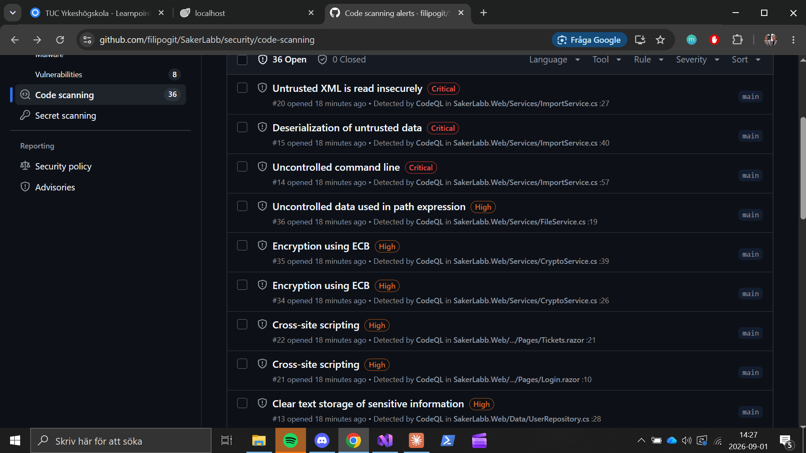

# Labbrapport: praktisk laboration

*Kunskapskontroll 2, IT-säkerhet för utvecklare. Fyll i mallen och lämna in som PDF tillsammans med länken till ditt repo. Riktlängd två till tre sidor.*

**Namn:** Filip Andersson
**Datum:** 2026-09-01
**Repo (länk till din fork):** https://github.com/filipogit/SakerLabb
**Applikation som analyserades:** SakerLabb Support – en .NET 10 Blazor-webbapp för ärendehantering (supporttickets) med SQLite-databas.

---

## 1. Kort om applikationen och analysen

SakerLabb Support är en intern supportapplikation byggd med ASP.NET Core 10 och Blazor SSR. Appen hanterar supportärenden, användarkonton och filbilagor. Den använder SQLite som databas och Newtonsoft.Json samt SixLabors.ImageSharp som tredjepartsbibliotek.

Statisk analys genomfördes med **CodeQL** via GitHubs default setup med språket C#. CodeQL kördes automatiskt mot main-branchen och identifierade 36 alerts (3 Critical, 14 High, 19 Medium). Dynamisk analys genomfördes med **OWASP ZAP 2.17.0** (quick scan med passiv och aktiv skanning) mot applikationen körande lokalt på `http://localhost:5080`. ZAP identifierade 14 alerts (1 High, 5 Medium, 4 Low, 4 Informational).

---

## 2. Fem fynd

| Nr | Källa (CodeQL/ZAP) | Regel-id eller alert | Allvarlighet (+ confidence för ZAP) | Fil och rad eller URL | Verkligt eller falskt positivt | Motivering (2–4 meningar) |
|----|--------------------|----------------------|-------------------------------------|-----------------------|--------------------------------|---------------------------|
| 1 | CodeQL | cs/sql-injection – "SQL query built from user-controlled sources" | High | TicketRepository.cs:26, :38, :48, :71, :80 samt UserRepository.cs:21, :46, :62, :72, :82, :91, :99 (12 alerts, #1–#12) | Verkligt positivt | Alla SQL-frågor byggs med strängkonkatenering direkt från användarinput (search, sort, id, username). En angripare kan injicera godtycklig SQL via t.ex. sökfältet eller URL-parametrar. Ger full kontroll över databasen inklusive läsning av personnummer, lösenordshashar och interna ärenden. |
| 2 | CodeQL | cs/command-line-injection – "Uncontrolled command line" | Critical | ImportService.cs:57 (alert #14) | Verkligt positivt | Metoden Ping tar emot en host-parameter från användaren och sätter in den direkt i ett cmd.exe-anrop via strängkonkatenering. En angripare kan lägga till `& whoami` eller `& net user` för att köra godtyckliga operativsystemkommandon på servern. |
| 3 | CodeQL | cs/web/xss – "Cross-site scripting" | High | Tickets.razor:21 och Login.razor:10 (alerts #21, #22) | Verkligt positivt | Razor-sidorna använder `MarkupString` för att rendera användarinput (sökord respektive användarnamn) utan HTML-encoding. En angripare kan injicera `<script>alert(document.cookie)</script>` via query-parametrarna search eller username och köra JavaScript i offrets webbläsare. |
| 4 | ZAP | 10037 – "Server Leaks Information via X-Powered-By HTTP Response Header Field(s)" | Low / Medium confidence | http://localhost:5080 (systemic, alla svar) | Verkligt positivt | Applikationen sätter headern `X-Powered-By: SakerLabb 1.4.2 (ASP.NET Core 10.0)` samt `X-Backend-Node` med maskinnamnet i varje HTTP-svar (Program.cs:37–38). Detta avslöjar exakt ramverksversion och serverns hostname, vilket ger en angripare värdefull information för att välja rätt exploit. |
| 5 | ZAP | 10038 – "Content Security Policy (CSP) Header Not Set" | Medium / High confidence | http://localhost:5080 (systemic, alla HTML-svar) | Verkligt positivt | Ingen Content-Security-Policy-header sätts i HTTP-svaren. CSP är ett viktigt defense-in-depth-lager som begränsar vilka källor webbläsaren får ladda script, stilmallar och andra resurser ifrån. Utan CSP underlättas XSS-attacker eftersom injicerad JavaScript körs utan restriktioner. |

Bevis (skärmbilder eller utdrag), numrerade efter fyndet ovan:

**Fynd 1–3 (CodeQL):**



- **Fynd 4–5:** ZAP-rapport (zap-report.html) genererad 2026-09-01 14:25. Rapporten visar "Server Leaks Information via X-Powered-By" som Low och "Content Security Policy (CSP) Header Not Set" som Medium, med URL:er och bevis.

---

## 3. Prioritering

**Prioritetsordning: 2 → 1 → 3 → 4 → 5**

1. **Command injection (#2, Critical)** – Högst prioritet. Ger direkt RCE (remote code execution) på servern utan autentisering. Endpoint:en `/diagnostik/ping` är öppet tillgänglig. En enda HTTP-request räcker för att ta över servern. Trivial att utnyttja.

2. **SQL injection (#1, High)** – Ger full kontroll över databasen med känslig data (personnummer, lösenord). Mycket enkelt att utnyttja via sökfältet. Inte direkt RCE men kan ge tillgång till alla uppgifter. Hög exponering eftersom sökfältet är tillgängligt för alla besökare.

3. **XSS (#3, High)** – Allvarligt och kräver att offret klickar på en förberedd länk (reflected XSS). Kan stjäla sessionscookies (HttpOnly=false förvärrar detta). Kräver social engineering men är en vanlig attackvektor.

4. **X-Powered-By-header (#4, Low)** – Informationsläckage som underlättar riktade attacker. Låg allvarlighetsgrad ensamt, men i kombination med andra brister ger det angriparen en fördel. Enkel att åtgärda.

5. **Saknad CSP (#5, Medium)** – Defense-in-depth. Utan CSP saknas ett viktigt skydd mot XSS. Prioriteras sist eftersom det är en härdningsåtgärd snarare än en direkt sårbarhet.

---

## 4. Åtgärder (minst tre)

### Åtgärd 1

```
Fynd:        Nr 1, cs/sql-injection (CodeQL alerts #1–#12)
Plats:       TicketRepository.cs (rad 26, 38, 48, 71, 80) och UserRepository.cs (rad 21, 46, 62, 72, 82, 91, 99)
Bevis före:  Skärmbild från Code Scanning som visar 12 "SQL query built from user-controlled sources" alerts med allvarlighetsgrad High
Bedömning:   Verkligt positivt. Alla SQL-frågor använder strängkonkatenering med input direkt från HTTP-requests.
Åtgärd:      Ersatte all strängkonkatenering med parametriserade frågor ($-parametrar via SqliteCommand.Parameters.AddWithValue). Sort-kolumnen valideras mot en whitelist. Lösenord loggas inte längre i klartext. Commit: 621c275
Bevis efter: Ny CodeQL-körning efter merge till main – alerts #1–#12 byter status till Fixed.
```

### Åtgärd 2

```
Fynd:        Nr 2, cs/command-line-injection (CodeQL alert #14)
Plats:       ImportService.cs:57
Bevis före:  Skärmbild från Code Scanning: "Uncontrolled command line", Critical, ImportService.cs:57
Bedömning:   Verkligt positivt. Host-parametern konkateneras rakt in i cmd.exe /c-anropet.
Åtgärd:      Ersatte cmd.exe-anropet med direkt ping-exekvering via ArgumentList (ingen shelltolkning). Lade till inputvalidering med regex-whitelist som bara tillåter [a-zA-Z0-9._-]. Commit: 68e56cd
Bevis efter: Ny CodeQL-körning efter merge till main – alert #14 byter status till Fixed.
```

### Åtgärd 3

```
Fynd:        Nr 3, cs/web/xss (CodeQL alerts #21, #22)
Plats:       Tickets.razor:21, Login.razor:10
Bevis före:  Skärmbild från Code Scanning: "Cross-site scripting", High, i Tickets.razor:21 och Login.razor:10
Bedömning:   Verkligt positivt. MarkupString kringgår Blazors automatiska HTML-encoding.
Åtgärd:      Tog bort MarkupString-casten så att Blazors standard @-output används, som automatiskt HTML-encodar all output. Commit: bce269c
Bevis efter: Ny CodeQL-körning efter merge till main – alerts #21 och #22 byter status till Fixed.
```

---

## 5. Eventuella bortval

**Fynd 4 (X-Powered-By-header, ZAP alert 10037):**
- **Risk:** Informationsläckage – avslöjar ramverksversion och hostname, underlättar riktade attacker.
- **Motiv för bortval:** Låg allvarlighetsgrad (Low). Åtgärden är enkel (ta bort headern i Program.cs:37–38) men prioriterades bort till förmån för de tre kritiska/höga fynden.
- **Kompenserande kontroll:** Reverse proxy/WAF kan strippas bort headern innan svaret når klienten.
- **Omprövning:** 2026-09-08

**Fynd 5 (Saknad CSP-header, ZAP alert 10038):**
- **Risk:** Utan CSP saknas begränsning av vilka källor som får köra script. Underlättar XSS.
- **Motiv för bortval:** Defense-in-depth – inte en direkt sårbarhet utan en härdningsåtgärd. Kräver noggrann konfiguration för att inte bryta funktionalitet.
- **Kompenserande kontroll:** XSS-sårbarheterna (#3) är redan åtgärdade med korrekt output-encoding. CSP bör införas som komplement.
- **Omprövning:** 2026-09-08

**Övriga kända brister (ej bland de fem, men dokumenterade av CodeQL):**
- XXE (cs/xml/insecure-dtd-processing, alert #20, Critical) – Åtgärdas genom att sätta DtdProcessing till Prohibit.
- Insecure deserialization (cs/unsafe-deserialization, alert #15, Critical) – Åtgärdas genom att ändra TypeNameHandling till None.
- Båda kräver autentisering på import-endpoints som kompenserande kontroll. Omprövning: 2026-09-08.
